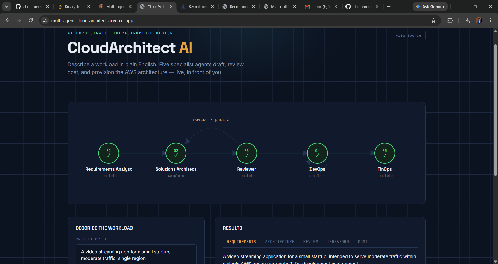
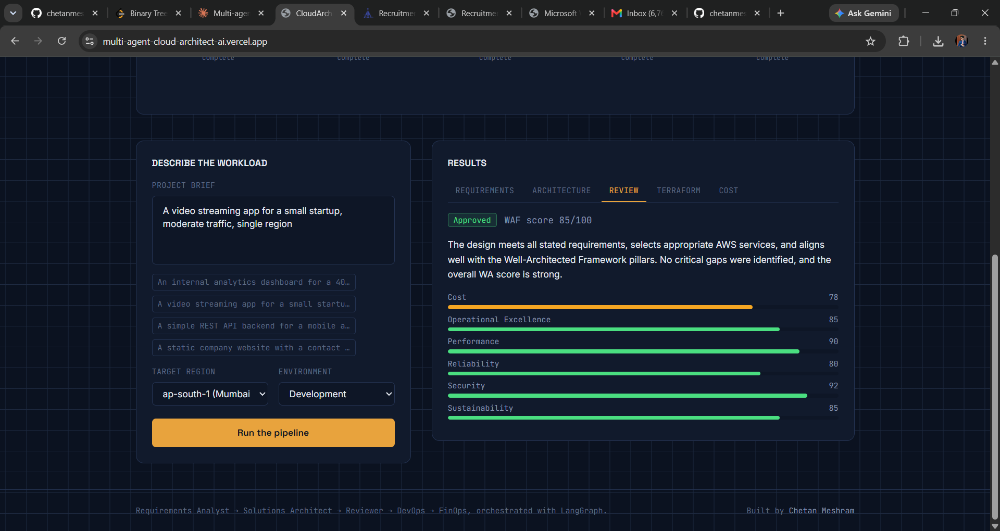
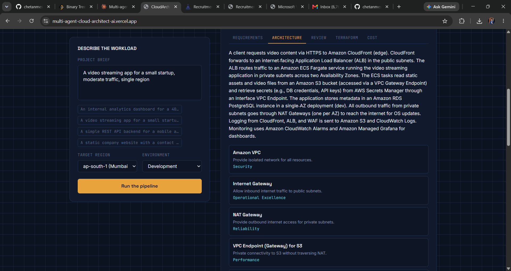
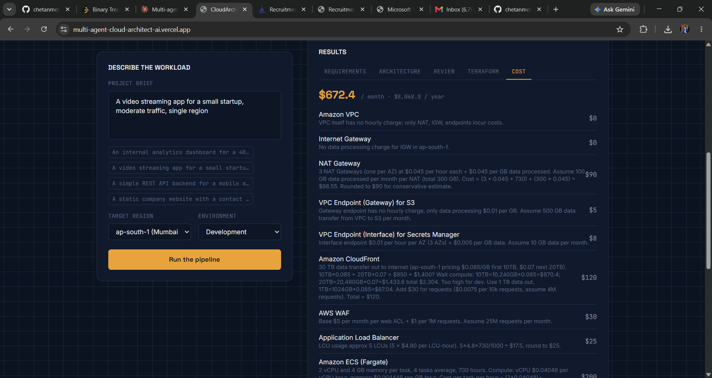
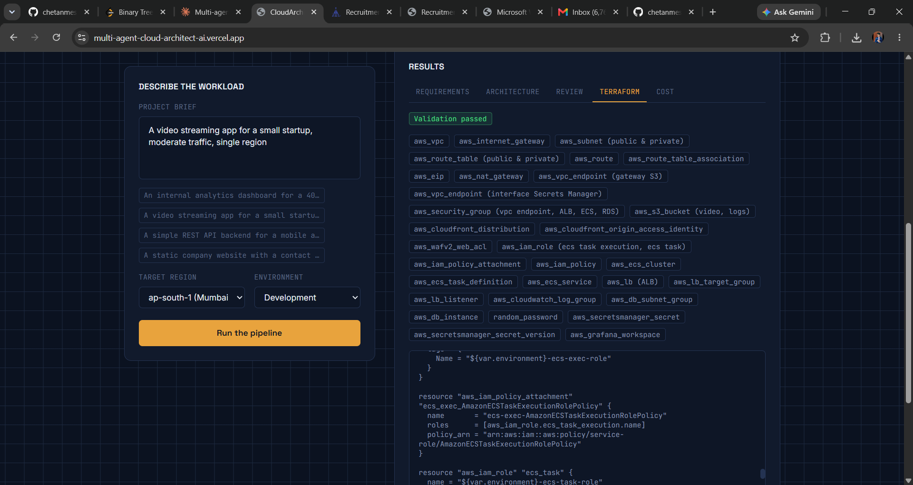
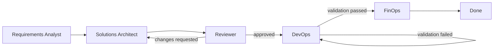

<div align="center">

# CloudArchitect AI

### A multi-agent system that designs, reviews, provisions, and prices AWS architecture — from a single sentence.

[](https://multi-agent-cloud-architect-ai.vercel.app/)


</div>

---

## What it does

Describe a workload in plain English — *"An internal analytics dashboard for a 40-person startup, low budget"* — and five specialist AI agents take it from there, live, in front of you:

```
Requirements Analyst → Solutions Architect → Reviewer ⇄ (revises) → DevOps ⇄ (retries) → FinOps
```

Each agent has one job, hands its output to the next, and the pipeline includes two real feedback loops — not just a linear chain:

- The **Reviewer** independently scores the design against all six AWS Well-Architected Framework pillars and sends it back to the **Architect** for revision if it doesn't meet the bar.
- **DevOps** validates its own generated Terraform and regenerates automatically if validation fails.

By the end, you have a complete architecture design, an independent WAF review with a numeric score, apply-ready Terraform, and a line-item monthly cost estimate — all from one sentence.

**[→ Try the live demo](https://multi-agent-cloud-architect-ai.vercel.app/)**

---

## See it in action

<div align="center">

### The pipeline, live
*Five agents visualized as an animated trace — watch each one run, including the revision loop when the Reviewer sends work back to the Architect.*



<br>

### Independent architecture review
*The Reviewer doesn't just rubber-stamp the design — it scores all six Well-Architected Framework pillars independently and explains its reasoning.*



<br>

### Full architecture, explained
*Every service comes with its purpose and which WAF pillar it serves — not just a service list, but the reasoning behind it.*



<br>

### Real cost estimates, line by line
*FinOps breaks down monthly cost per service with the actual pricing assumptions it used — not a single guessed number.*



<br>

### Apply-ready Terraform
*DevOps generates and self-validates complete HCL — every resource tagged and traceable back to the architecture above.*



</div>

---

## How the pipeline is orchestrated

Built with **LangGraph** as a real stateful graph, not a fixed sequence of function calls:

- **Revision loop** — if the Reviewer doesn't approve the design, the Architect receives the specific required changes and produces a new revision, up to 3 passes, so it never stalls indefinitely.
- **Terraform retry loop** — if generated HCL fails self-validation (brace balance, required provider blocks, no placeholder text, at least one real resource), DevOps regenerates, up to 2 retries.
- Every node reports progress through a callback, streamed to the frontend as Server-Sent Events — so the UI shows live per-agent status instead of one long spinner.



---

## Tech stack

| Layer | Technology |
|---|---|
| **Orchestration** | LangGraph — stateful multi-agent graph with conditional routing |
| **LLM Inference** | Groq (`openai/gpt-oss-120b`) via `langchain-groq` |
| **Backend** | FastAPI, Pydantic v2, Server-Sent Events for live progress |
| **Frontend** | React 18, Vite, Tailwind CSS |
| **Infra output** | Terraform (self-validated HCL) |
| **Deployment** | Render (backend) · Vercel (frontend) |

---

## Getting started locally

### Backend

```bash
cd backend
pip install -r requirements.txt
cp .env.example .env        # add your GROQ_API_KEY
python main.py                # → http://localhost:8000
```

### Frontend

```bash
cd frontend
npm install
cp .env.example .env        # VITE_API_URL=http://localhost:8000
npm run dev                   # → http://localhost:5173
```

---

## Project structure

```
cloudarchitect-ai/
├── backend/
│   ├── agents/                  # 5 standalone, independently-testable agents
│   ├── orchestration/graph.py   # LangGraph wiring — revision loop + retry loop
│   ├── schemas/models.py        # single source of truth Pydantic models
│   ├── tools/                   # Terraform validator, LLM retry handling
│   └── main.py                  # FastAPI app (blocking + SSE streaming endpoints)
└── frontend/
    └── src/
        ├── App.jsx
        └── components/
            ├── PipelineTrace.jsx   # live animated agent trace
            ├── BriefForm.jsx
            └── ResultsPanels.jsx
```

---

## A note on the demo's limits

This runs on Groq's free tier, which caps total throughput per account (not per user) at 8,000 tokens/minute and 200,000 tokens/day. In practice that means the live demo comfortably handles one person running it at a time, and roughly 8–12 full pipeline runs across *all* visitors per day before the daily quota resets. Complex briefs (multi-region, compliance-heavy, very high traffic) produce larger architectures and are more likely to hit that ceiling than modest ones — the example prompts on the page are chosen to stay well within it.

This isn't a bug so much as an honest constraint of building on a free inference tier — flagging it here rather than letting it look like the app is broken.

---

<div align="center">

Built by **Chetan Meshram**

<!-- Add your links here, e.g.: -->
<!-- [LinkedIn](your-linkedin-url) · [GitHub](your-github-url) · [Portfolio](your-portfolio-url) -->

</div>
